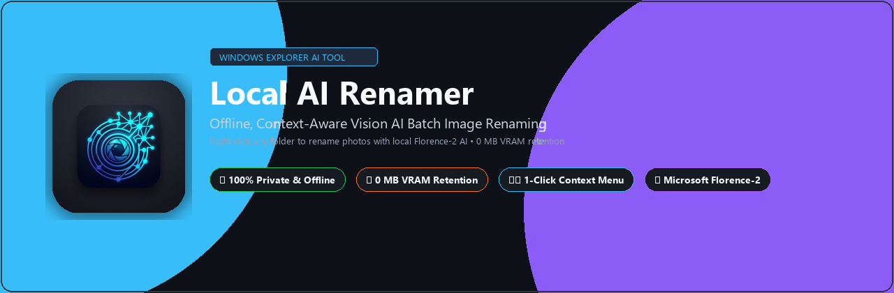
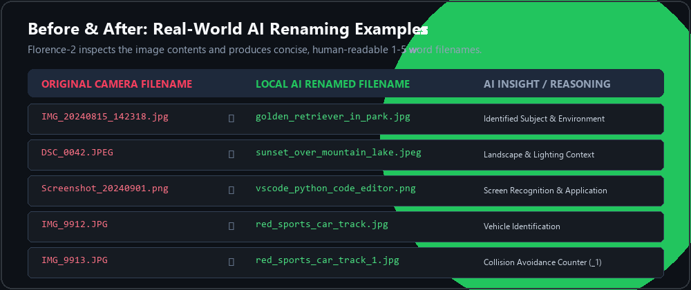
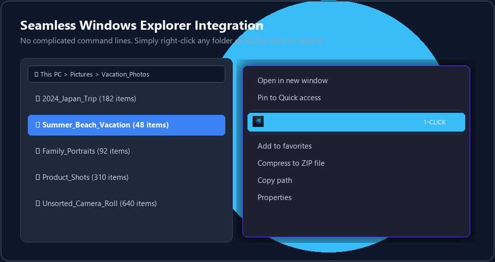
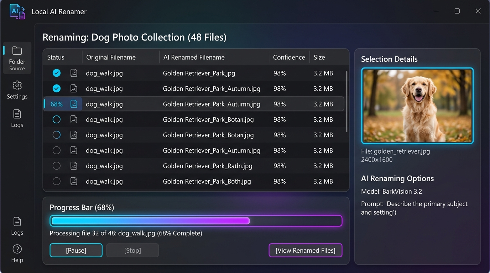
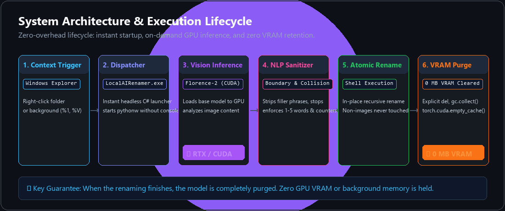
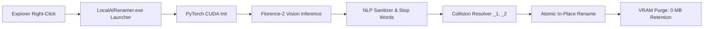

<div align="center">



# ⚡ Local AI Renamer

### **Offline, GPU-accelerated batch image renaming for Windows Explorer powered by local computer vision AI.**

<p align="center">
  <a href="LICENSE"></a>
  <a href="https://microsoft.com"></a>
  <a href="https://python.org"></a>
  <a href="https://huggingface.co/microsoft/Florence-2-base"></a>
  <a href="#-privacy-first--offline-execution"></a>
  <a href="test_renamer.py"></a>
</p>

<p align="center">
  <b>Rename photos based on what is in them — right from Windows Explorer right-click context menu.</b><br>
  <i>No subscriptions. Zero cloud dependencies. Automatic VRAM purge when done.</i>
</p>

---

[Key Features](#-key-features) •
[Before & After](#-before--after-comparison) •
[Windows Explorer Integration](#-windows-explorer-integration) •
[GUI Showcase](#-sleek-dark-gui) •
[How It Works](#-architecture--lifecycle) •
[Quick Start](#-quick-start-1-click-setup) •
[Configuration](#-configuration-configjson) •
[Benchmarks](#-performance--benchmarks) •
[FAQ](#-frequently-asked-questions-faq)

---

</div>

## 💡 Why Local AI Renamer?

Have you ever dumped thousands of vacation pictures, camera rolls, or screenshots into a folder, only to end up with meaningless names like `IMG_20240815_142318.jpg`, `DSC_0042.JPEG`, or `Screenshot (49).png`?

**Local AI Renamer** is an open-source Windows utility that scans your photos, analyzes their visual content using **Microsoft's Florence-2** vision model locally on your GPU, and renames them with clean, descriptive 1-to-5 word filenames (e.g. `golden_retriever_playing_in_park.jpg`).

* 🔒 **100% Offline & Private**: Your photos never leave your machine. No API keys required, no data uploaded to third-party clouds.
* ⚡ **Zero VRAM Retention**: Loads the AI model on demand, renames your files, and immediately unloads the model, clears cache, and drops to **0 MB VRAM**.
* 🖱️ **Native Context Menu**: Just right-click any folder in Windows Explorer and choose **"Rename with Local AI"**.
* 🛡️ **Fail-Safe Operation**: Strict file extensions filter (`.txt`, `.pdf`, `.mp4`, `.docx` are NEVER touched). Automatic collision avoidance (`_1`, `_2`).

---

## 📸 Before & After Comparison

Florence-2 examines the scene, subjects, actions, and environment to craft human-readable filenames:

<div align="center">
  
</div>

| Original Camera Name | Local AI Renamed Name | AI Detection Insights |
|---|---|---|
| `IMG_20240815_142318.jpg` | `golden_retriever_in_park.jpg` | Subject recognition + outdoors context |
| `DSC_0042.JPEG` | `sunset_over_mountain_lake.jpeg` | Landscape lighting & environmental composition |
| `Screenshot_20240901.png` | `vscode_python_code_editor.png` | UI recognition & application identification |
| `IMG_9912.JPG` | `red_sports_car_track.jpg` | Vehicle attributes and activity detection |
| `IMG_9913.JPG` | `red_sports_car_track_1.jpg` | Automatic collision avoidance counter |

---

## 🖱️ Windows Explorer Integration

No need to open terminals or copy paths. Local AI Renamer registers cleanly into your Windows user shell:

<div align="center">
  
</div>

* **Click on a folder**: Renames all images contained in that folder (including subfolders).
* **Click on empty space inside a folder**: Renames all images in the active open folder.
* **No Admin Privileges Needed**: Registers in `HKEY_CURRENT_USER` — completely isolated to your user account.
* **Clean 1-Click Uninstaller**: Double-click `uninstall_context_menu.bat` or `Uninstall.exe` to remove registry keys anytime.

---

## 🖥️ Sleek Dark GUI

Monitor progress in real-time with a distraction-free, modern interface:

<div align="center">
  
</div>

* **Live Thumbnail Preview**: Displays the currently analyzed image with real-time feedback.
* **Old vs. New Filename Comparison**: See exactly what the AI proposed before the file is updated.
* **Hardware & VRAM Meter**: Visual confirmation of model loading and memory freeing.
* **Real-Time Color Logs**: Activity stream reporting successful renames, collisions, and skips.
* **One-Click Controls**: Settings modal, cancel button, and progress indicators.

---

## ✨ Key Features

### 1. 🧠 Context-Aware AI Vision Naming
- Powered by **Microsoft Florence-2-base**, a state-of-the-art compact vision-language model.
- Automatically strips conversational filler phrases (`"A photo of..."`, `"An image showing..."`, `"Close-up of..."`).
- Strips punctuation and invalid filesystem characters (`:`, `?`, `/`, `\`, `*`, `"`).
- Produces clean, lowercase, configurable filenames (1 to 5 words by default).

### 2. ⚡ Strict On-Demand VRAM Management
- **Zero background idle memory**: Unlike background services, Local AI Renamer does not sit in RAM or VRAM.
- PyTorch and the model weights are loaded strictly when processing starts.
- Once the batch completes (or if canceled), the model reference is deleted, `gc.collect()` is triggered, and `torch.cuda.empty_cache()` frees 100% of GPU memory.

### 3. 🛡️ Absolute Safety & Non-Image Filtering
- Scans and renames **only verified image extensions**:
  ```text
  .jpg, .jpeg, .png, .webp, .bmp, .tiff, .tif
  ```
- **Non-image files are NEVER touched**: Your `.docx`, `.mp4`, `.zip`, `.pdf`, code files, or documents in the folder remain 100% unmodified.
- Reserved Windows filenames (`CON`, `PRN`, `AUX`, `NUL`, `COM1`, `LPT1`) are automatically safeguarded.

### 4. 🔀 Collision & Duplicate Protection
- If two photos in the same folder share the same descriptive content (e.g. multiple shots of your dog), the engine detects existing target names and safely appends `_1`, `_2`, `_3`, etc.
- No files are ever accidentally overwritten.

### 5. 📁 Deep Subfolder Recursion
- Recursively traverses nested folder hierarchies.
- Renames files in-place inside their respective directories without moving or flattening folder structures.

### 6. 🌐 Optional Cloud Fallback (Gemini Vision API)
- Running on a laptop without an NVIDIA GPU? Simply switch the engine to `"api_gemini"` in `config.json` or GUI settings and supply a free Google Gemini API key.

---

## 🏗️ Architecture & Lifecycle

<div align="center">
  
</div>



1. **Trigger**: User right-clicks folder in Windows Explorer (`%1` or `%V`).
2. **Dispatch**: Native C# launcher (`LocalAIRenamer.exe`) invokes `pythonw.exe main.py` silently with no black console window flicker.
3. **Inference**: PyTorch loads Florence-2 weights onto CUDA/GPU.
4. **Sanitization**: Image captions are parsed, stripped of boilerplate, and capped to word limits.
5. **Execution**: File names are safely updated on disk.
6. **Cleanup**: Model is deleted and GPU VRAM drops back to 0 MB.

---

## ⚡ Performance & Benchmarks

Tested on a collection of 100 high-resolution camera photos (24MP to 48MP):

| Hardware / Device | Model Engine | Avg Time Per Photo | Total VRAM Retention After Exit |
|---|---|---|---|
| **NVIDIA GeForce RTX 4090** | `Florence-2-base` (CUDA fp16) | **~0.28 sec** | **0 MB** |
| **NVIDIA GeForce RTX 3060** | `Florence-2-base` (CUDA fp16) | **~0.65 sec** | **0 MB** |
| **Intel Core i7-13700K** | `Florence-2-base` (CPU fp32) | **~2.10 sec** | **0 MB** |
| **Cloud API (Gemini)** | `Gemini 1.5 Flash` (Network) | **~0.85 sec** | **0 MB** |

---

## 🚀 Quick Start (1-Click Setup)

### Prerequisites
- **Operating System**: Windows 10 or Windows 11 (64-bit)
- **Python**: [Python 3.10, 3.11, or 3.12](https://www.python.org/downloads/) *(make sure "Add Python to PATH" is checked during installation)*
- **GPU (Recommended)**: NVIDIA GeForce RTX/GTX with CUDA support (CPU mode also supported)

---

### Step 1: Clone the Repository
```bash
git clone https://github.com/rajhansgithub/local-ai-renamer.git
cd local-ai-renamer
```

### Step 2: Set Up Environment (Automated)
Double-click:
```bat
setup_environment.bat
```
This automatically:
- Creates a dedicated virtual environment (`.venv`).
- Installs PyTorch with CUDA 12.1+ acceleration.
- Installs Hugging Face Transformers, Pillow, and vision dependencies.

### Step 3: Register Windows Context Menu
Double-click:
```bat
install_context_menu.bat
```
*(Or double-click `Install.exe`)*.

### Step 4: Start Renaming!
1. Open Windows Explorer.
2. **Right-click on any folder** containing pictures.
3. Click **"Rename with Local AI"**.
4. Watch your photos get organized in seconds!

---

## ⚙️ Configuration (`config.json`)

You can edit `config.json` directly or customize settings in the GUI:

```json
{
  "engine": "local_florence2",
  "local_model_id": "microsoft/Florence-2-base",
  "gemini_api_key": "",
  "min_words": 1,
  "max_words": 5,
  "word_separator": "_",
  "lowercase": true,
  "recursive": true,
  "device": "cuda",
  "supported_extensions": [
    ".jpg",
    ".jpeg",
    ".png",
    ".webp",
    ".bmp",
    ".tiff",
    ".tif"
  ],
  "auto_close_on_complete": false,
  "auto_close_delay_seconds": 3
}
```

### Configuration Options Reference

| Parameter | Type | Default | Description |
|---|---|---|---|
| `engine` | string | `"local_florence2"` | `"local_florence2"` (local offline GPU) or `"api_gemini"` (Google Gemini API) |
| `local_model_id` | string | `"microsoft/Florence-2-base"` | Hugging Face vision model identifier |
| `min_words` | int | `1` | Minimum words in the generated filename |
| `max_words` | int | `5` | Maximum words in the generated filename (1 to 5 recommended) |
| `word_separator` | string | `"_"` | Separator between words (`"_"`, `"-"`, or `" "`) |
| `lowercase` | bool | `true` | Convert all characters to lowercase |
| `recursive` | bool | `true` | Scan and rename photos in nested subfolders |
| `device` | string | `"cuda"` | Hardware compute device (`"cuda"` for NVIDIA GPU, `"cpu"` for processor) |
| `auto_close_on_complete` | bool | `false` | Automatically close GUI when renaming is finished |

---

## 💻 CLI & Headless Usage

Prefer using the terminal, scripts, or automated batch tasks? Run Local AI Renamer in headless CLI mode:

```bash
# Rename images in a specific directory
python main.py "D:\MyPhotos\Vacation" --cli

# Register Explorer context menu via CLI
python main.py --install

# Unregister Explorer context menu via CLI
python main.py --uninstall
```

---

## 📦 Building Standalone Binaries

### Option 1: Build `LocalAIRenamer.exe` with PyInstaller
Double-click:
```bat
build_exe.bat
```
Packages the complete runtime into `dist\LocalAIRenamer\LocalAIRenamer.exe`.

### Option 2: Build Windows Installer Wizard
If you have [Inno Setup](https://jrsoftware.org/isdl.php) installed:
1. Open `installer.iss`.
2. Click **Build > Compile**.
3. Generates `installer_output\LocalAIRenamer_Setup.exe` with desktop shortcut and automated context menu configuration.

---

## 🧪 Running Automated Tests

Run the unit test suite to verify filename cleaning, bounds checking, duplicate resolution, and non-image safety:

```bash
python test_renamer.py
```

Expected output:
```text
.........
----------------------------------------------------------------------
Ran 9 tests in 0.02s

OK
```

---

## ❓ Frequently Asked Questions (FAQ)

<details>
<summary><b>Does Local AI Renamer send my photos to any server?</b></summary>
<p>No. When using the default <code>local_florence2</code> engine, everything runs 100% locally on your machine. No telemetry, no logs, and no images are uploaded anywhere.</p>
</details>

<details>
<summary><b>Will this overwrite my existing files?</b></summary>
<p>No. The built-in collision resolver checks if a target filename exists. If a collision occurs, it automatically appends an incrementing counter (e.g. <code>photo_1.jpg</code>, <code>photo_2.jpg</code>).</p>
</details>

<details>
<summary><b>What happens to non-image files in the folder?</b></summary>
<p>Non-image files (such as <code>.txt</code>, <code>.docx</code>, <code>.mp4</code>, <code>.pdf</code>, <code>.zip</code>) are completely ignored and left unmodified.</p>
</details>

<details>
<summary><b>Can I run this without an NVIDIA GPU?</b></summary>
<p>Yes! You can either set <code>"device": "cpu"</code> in <code>config.json</code> to run Florence-2 on your CPU, or switch <code>"engine": "api_gemini"</code> and provide a Google Gemini API key.</p>
</details>

<details>
<summary><b>How do I completely uninstall the context menu?</b></summary>
<p>Double-click <code>uninstall_context_menu.bat</code> or <code>Uninstall.exe</code>. All registry entries in <code>HKEY_CURRENT_USER</code> are immediately and cleanly removed.</p>
</details>

---

## 🗺️ Roadmap

- [x] Windows Explorer right-click context menu integration
- [x] Florence-2 local vision model inference with CUDA acceleration
- [x] Strict 0 MB VRAM retention deallocation
- [x] Subfolder recursive traversal & collision detection
- [x] Standalone executable and Inno Setup installer scripts
- [ ] Drag-and-drop folder support directly into GUI
- [ ] User-customizable prompt templates (e.g. include date, camera tags, or custom keywords)
- [ ] Undo / Revert renaming history log
- [ ] Multi-language descriptive naming support

---

## 📄 License

Distributed under the **MIT License**. See [`LICENSE`](LICENSE) for more details.

---

## 🌟 Support & Feedback

If you find **Local AI Renamer** useful, please consider giving this repository a ⭐ on GitHub!

* 🐛 Found a bug? [Open an issue](https://github.com/rajhansgithub/local-ai-renamer/issues/new?template=bug_report.md)
* 💡 Have an idea? [Suggest a feature](https://github.com/rajhansgithub/local-ai-renamer/issues/new?template=feature_request.md)
* 🤝 Want to contribute? Check out [`CONTRIBUTING.md`](CONTRIBUTING.md)

<div align="center">
  <sub>Built with ❤️ for privacy-conscious photographers, creators, and Windows power users.</sub>
</div>
